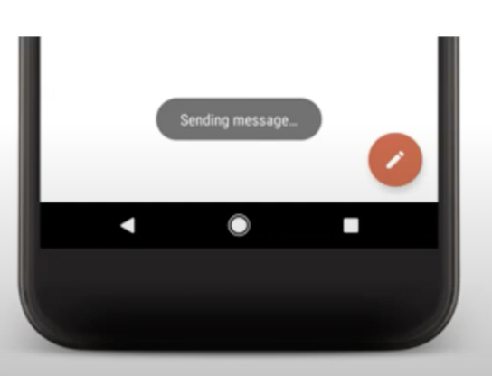

# Testing Toast Message

- A toast message provides a simple feedback about an operation in a small popup.

- It only fills the amount of space required for the message and the current activity remains visible and interactive. 

- Toast automatically disappears after a timeout.

### For example

- Clicking Send an email triggers  a "Sending message...." toast.



## ToastMatcher 

```java
package com.tau.toastdemo;

import android.os.IBinder;
import android.view.WindowManager;
import org.hamcrest.Description;
import org.hamcrest.TypeSafeMatcher;
import androidx.test.espresso.Root;

class ToastMatcher extends TypeSafeMatcher<Root> {

    @Override
    public void describeTo(Description description) {
       description.appendText("is toast");
    }

    @Override
    protected boolean matchesSafely(Root root) {
        int type = root.getWindowLayoutParams().get().type;
        if ((type == WindowManager.LayoutParams.TYPE_TOAST)) {
            IBinder windowToken = root.getDecorView().getWindowToken();
            IBinder appToken = root.getDecorView().getApplicationWindowToken();
            return windowToken == appToken;
        }
        return false;
    }
}
```

## MainActivityTest

```java 
package com.tau.toastdemo;

import org.junit.Rule;
import org.junit.Test;
import org.junit.runner.RunWith;

import androidx.test.ext.junit.rules.ActivityScenarioRule;
import androidx.test.ext.junit.runners.AndroidJUnit4;
import androidx.test.filters.SmallTest;

import static androidx.test.espresso.Espresso.onView;
import static androidx.test.espresso.action.ViewActions.click;
import static androidx.test.espresso.assertion.ViewAssertions.matches;
import static androidx.test.espresso.matcher.ViewMatchers.isDisplayed;
import static androidx.test.espresso.matcher.ViewMatchers.withId;
import static androidx.test.espresso.matcher.ViewMatchers.withText;

@RunWith(AndroidJUnit4.class)
@SmallTest
public class MainActivityTest
{
    private static final String toastMessage = "Hello from Test Automation University";

    @Rule
    public ActivityScenarioRule<MainActivity> rule =
        new ActivityScenarioRule<>(MainActivity.class);

    @Test
    public void testToastMessage()
    {
        onView(withId(R.id.buttonToast))
            .perform(click());

        onView(withText((toastMessage)))
            .inRoot(new ToastMatcher())
            .check(matches(isDisplayed()));
    }
}
```