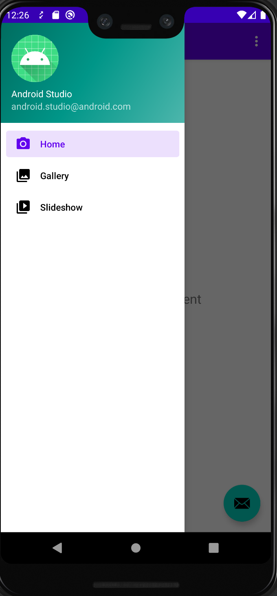

# Testing Drawer

- **`DrawerLayout`** acts as a top-level contrainer for window content that allows for interactive **"drawer"** views to be pulled out from one or both vertical edges of the window.

- **`DrawerActions`** is the Espresso actions for using a DrawerLayout.



## Test Code

```java
@Test
    public void openDrawer()
    {
        //id/drawer_layout
        int DrawerID = R.id.drawer_layout;


        // Open Drawer
        onView(withId(DrawerID)).perform(DrawerActions.open())
                .check(matches(isOpen()));

        // Click on Gallery
        onView(withText("Gallery"))
                .perform(click());

        // Assert Gallery Activity is displayed
        onView(withId(R.id.text_gallery))
                .check(matches(isDisplayed()));

        // Open Drawer
        onView(withId(DrawerID)).perform(DrawerActions.open())
                .check(matches(isOpen()));

        // Click Home
        onView(withText("Home"))
                .perform(click());

        // Assert Home Activity is displayed
        //id/text_home
        onView(withId(R.id.text_home))
                .check(matches(isDisplayed()));

        // Close Drawer
        onView(withId(DrawerID)).perform(DrawerActions.close())
                .check(matches(isClosed()));
    }
```