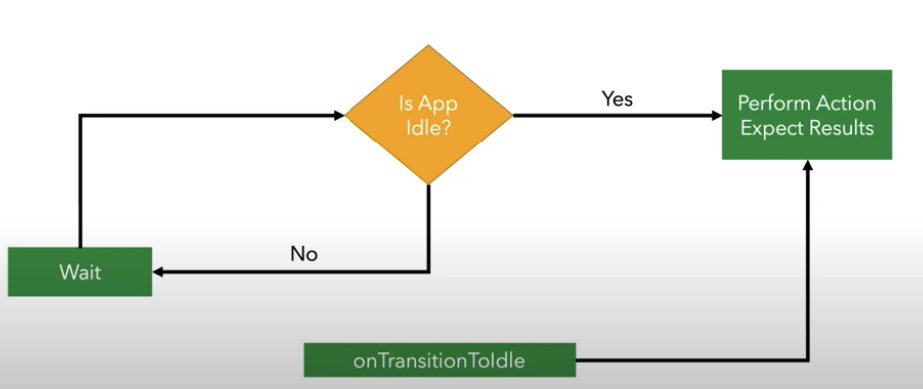

# What are the Idling Resources?

- Idling resource represents an asynchronous operation whose results affect subsequent opertions in a UI test.

- By registring idling resources with Espresso, you can validate these asynchronous operations more reliably when resting your app.

- In order to make Espresso aware of your app's long-running operations, you must register one as an idling resource.

## How does it work?



## Test Code

```java
package com.example.android.testing.espresso.IdlingResourceSample;

import static androidx.test.espresso.Espresso.closeSoftKeyboard;
import static androidx.test.espresso.Espresso.onView;
import static androidx.test.espresso.action.ViewActions.click;
import static androidx.test.espresso.action.ViewActions.typeText;
import static androidx.test.espresso.assertion.ViewAssertions.matches;
import static androidx.test.espresso.matcher.ViewMatchers.withId;
import static androidx.test.espresso.matcher.ViewMatchers.withText;

import androidx.test.core.app.ActivityScenario;
import androidx.test.espresso.IdlingRegistry;
import androidx.test.espresso.IdlingResource;
import androidx.test.ext.junit.rules.ActivityScenarioRule;
import androidx.test.ext.junit.runners.AndroidJUnit4;

import org.junit.After;
import org.junit.Before;
import org.junit.Rule;
import org.junit.Test;
import org.junit.runner.RunWith;

@RunWith(AndroidJUnit4.class)
public class ChangeTextBehaviourTest1
{
    @Rule public ActivityScenarioRule<MainActivity> activityScenarioRule =
            new ActivityScenarioRule<>(MainActivity.class);

    private IdlingResource myIdling;

    @Before
    public void registerIdlingResource(){
        ActivityScenario activityScenario = ActivityScenario.launch(MainActivity.class);
        activityScenario.onActivity(new ActivityScenario.ActivityAction<MainActivity>() {
            @Override
            public void perform(MainActivity activity) {
                myIdling = activity.getIdlingResource();
                // To prove that the test fails, omit this call:
                IdlingRegistry.getInstance().register(myIdling);
            }
        });
    }


    @Test
    public  void changeText_sameActivity()
    {
        onView(withId(R.id.editTextUserInput))
                .perform(typeText("Hello Nihal Alfred"));
        closeSoftKeyboard();

        onView(withId(R.id.changeTextBt))
                .perform(click());

        onView(withId(R.id.textToBeChanged))
                .check(matches(withText("Hello Nihal Alfred")));
    }

    @After
    public void unregisterIdlingResource() {
        if (myIdling != null) {
            IdlingRegistry.getInstance().unregister(myIdling);
        }
    }
}

```