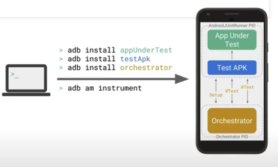

# Android Test Orchestrator

- Allows you to run each of your app's tests within its own invocation of instrumentation.

- Android Test Orchestrator offers the following benefits for your testing environment:

    a. **Minimal shared state**: Each test runs in its own Instrumentation instance. To remove all shared state from your device's CPU and memory after each test, use the **clearPackageData** flag. 

    b. **Crashes are isolated:**: Even if one test crashes, it takes down only its own instance of Instrumentation, so the other tests in your suite still run. 

## Android Test Orchestratror Structure

- Android Test Orchestrator collects JUnit tests at the beginning of your test suite run.
- But it then executes each test seperately, in its own instance of Instrumentation. 

