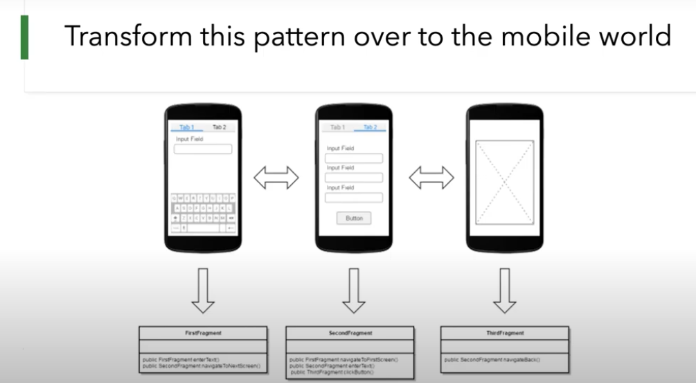

# What is the Page Object Design Patterns?

- Every functional unit of the displayed page should be wrapped by a Page Object.

- The Page Object allows you to interact with the UI as if you were sitting in front of the screen and offers reusability of the written code.

